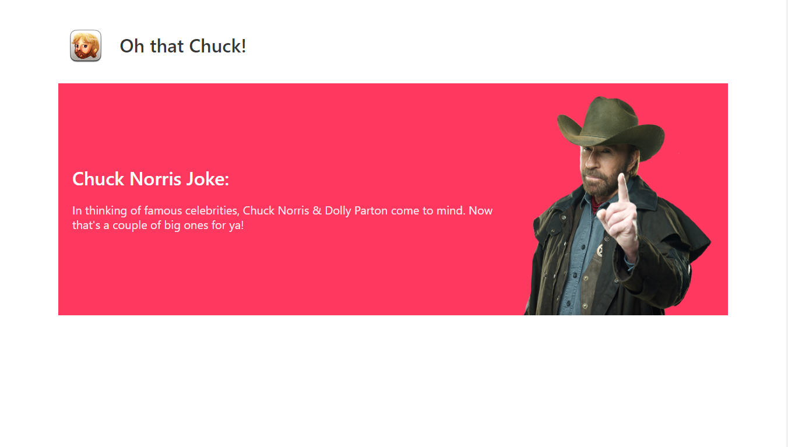

## 🔫🔫🔫 Oh That Chuk! 🔫🔫🔫

This funny app is demonstrating the use of VueJS and Bulma framework. <br/>
It's fetching data from ```https://api.chucknorris.io/``` REST API and getting new random Chuck Norris Joke every 15 seconds.

#### Frameworks used
- VueJS
- Bulma CSS
- Axios

### TO-DO:
1. [x] Create base layout
2. [x] Create request to API
3. [x] Set timer for updates every 15 seconds
4. [x] Insert "profile pic" of Chuck
5. [ ] Add category selector tool
6. [ ] Extend layout to be responsive


